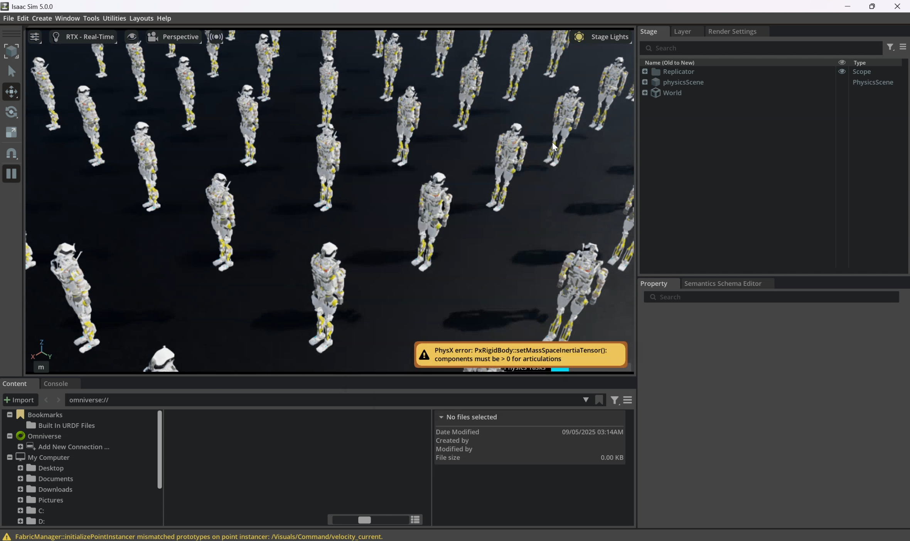
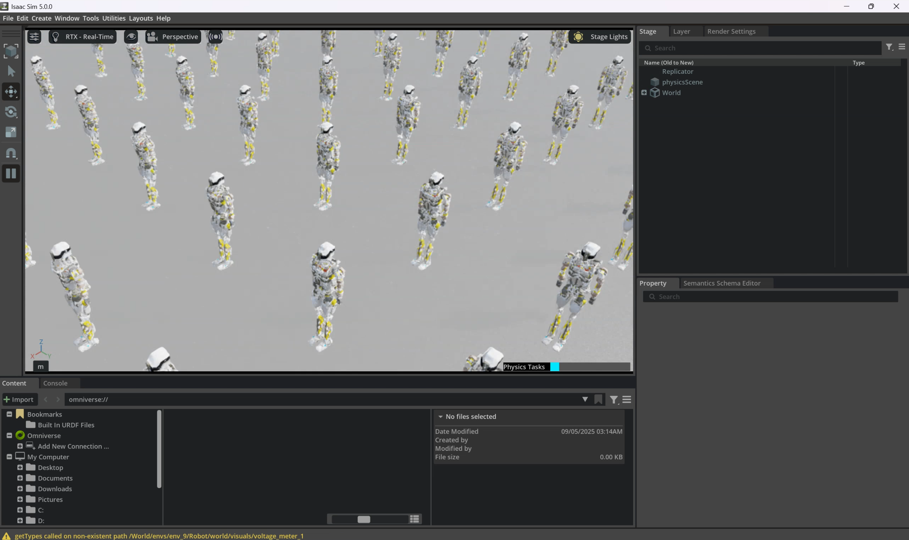

# Dropbear RL Lab using Isaac Sim and Isaac Lab

<div align="center">


[](https://hyperspawn.co)
[](https://github.com/hyperspawn/dropbear_isaac/issues)
[](https://discord.com/invite/tFeqrdJzkS)
[](https://t.me/fractionalrobots)
[](https://www.hyperspawn.co/docs)
[](https://hyperspawn.co/gallery)
[](https://hyperspawn.co/buy)
[](https://hyperspawn.co/sim)

**Advanced Reinforcement Learning Environments for Dropbear**

*by Hyperspawn Robotics*



</div>

## 🚀 Overview

Dropbear RL Lab is a reinforcement learning framework for Dropbear robot. Run using NVIDIA's Isaac Sim and Isaac Lab platform, it provides a nice simulation environment for training bipedal locomotion policies with state-of-the-art performance.

### ✨ Key Features

- 🏃‍♂️ **Advanced Locomotion**: Velocity tracking, terrain adaptation, and gait optimization
- ⚡ **High Performance**: GPU-accelerated training with thousands of parallel environments
- 🔧 **Modular Design**: Easy to extend and customize for different tasks
- 📊 **Rich Observations**: IMU data, joint states, contact forces, and terrain scanning

## 📋 Prerequisites

- **Isaac Sim 5.0.0** or later
- **Isaac Lab 2.2.0** or later
- **NVIDIA GPU** with CUDA support
- **Python 3.10+**

## 🛠️ Installation

### 1. Install Isaac Sim and Isaac Lab

Follow the official [Isaac Lab installation guide](https://isaac-sim.github.io/IsaacLab/source/setup/installation.html).

### 2. Clone and Install Dropbear RL Lab

```bash
git clone https://github.com/hyperspawn/dropbear_rl_lab.git
cd dropbear_rl_lab

# Install dependencies for video recording
C:\isaac-sim\python.bat -m pip install moviepy

# Install in development mode
C:\isaac-sim\python.bat -m pip install -e source/dropbear_rl_lab
```

### 3. Verify Installation

```bash
# Quick training test (1 iteration) - CONFIRMED WORKING
C:\isaac-sim\python.bat scripts/rsl_rl/train.py --task Isaac-Velocity-Dropbear-v0 --max_iterations 1

# Test play with video recording - CONFIRMED WORKING  
C:\isaac-sim\python.bat scripts/rsl_rl/play.py --task Isaac-Velocity-Dropbear-Play-v0 --video
```

## 🎮 Quick Start

<div align="center">

</div>


### Training a Policy

```bash
# ✅ CONFIRMED WORKING: Quick test training (1 iteration)
C:\isaac-sim\python.bat scripts/rsl_rl/train.py --task Isaac-Velocity-Dropbear-v0 --max_iterations 1

# Full velocity tracking policy training
C:\isaac-sim\python.bat scripts/rsl_rl/train.py --task Isaac-Velocity-Dropbear-v0 --max_iterations 2000

# Train with video recording
C:\isaac-sim\python.bat scripts/rsl_rl/train.py --task Isaac-Velocity-Dropbear-v0 --video --video_interval 1000
```

### Playing a Trained Policy

```bash
# ✅ CONFIRMED WORKING: Play with video recording (requires moviepy)
C:\isaac-sim\python.bat scripts/rsl_rl/play.py --task Isaac-Velocity-Dropbear-Play-v0 --video

# Play without video (requires trained model)
C:\isaac-sim\python.bat scripts/rsl_rl/play.py --task Isaac-Velocity-Dropbear-Play-v0

# Play specific checkpoint
C:\isaac-sim\python.bat scripts/rsl_rl/play.py --task Isaac-Velocity-Dropbear-Play-v0 --checkpoint logs/rsl_rl/dropbear_velocity/2025-09-05_01-07-24/model_0.pt
```

## 📁 Repository Structure

```
dropbear_rl_lab/
├── 📄 README.md                                    # This file
├── 📄 LICENSE                                      # License
├── 📄 .gitignore                                   # Git ignore rules
├── 🤖 dropbear_model/                              # Robot USD models
│   └── Dropbear/usd/dropbear.usd                  # Main robot model
├── 🎬 media/gallery/                               # Demo videos and images
├── 📜 scripts/                                     # Training and utility scripts
│   ├── list_envs.py                               # Environment listing
│   └── rsl_rl/                                    # RSL-RL training scripts
│       ├── train.py                               # Training script
│       ├── play.py                                # Policy playback
│       └── cli_args.py                            # CLI argument parsing
└── 📦 source/dropbear_rl_lab/                     # Main package
    ├── config/extension.toml                      # Extension configuration
    ├── pyproject.toml                             # Python project config
    ├── setup.py                                   # Installation script
    └── dropbear_rl_lab/                           # Core package
        ├── assets/robots/                         # Robot configurations
        │   ├── dropbear.py                        # Dropbear robot config
        ├── tasks/locomotion/                      # Locomotion tasks
        │   ├── mdp/                               # MDP components
        │   │   ├── rewards.py                     # Reward functions
        │   │   ├── observations.py                # Observation functions
        │   │   └── commands.py                    # Command generators
        │   └── robots/dropbear/                   # Dropbear-specific configs
        │       ├── velocity_env_cfg.py            # Environment config
        │       └── agents/rsl_rl_ppo_cfg.py       # PPO agent config
        └── utils/                                 # Utility functions
```

## 🏋️ Available Tasks

| Task ID | Description | Action Space | Observation Space |
|---------|-------------|--------------|-------------------|
| `Isaac-Velocity-Dropbear-v0` | Velocity tracking on flat terrain | 22 DoF | 50-dim |
| `Isaac-Velocity-Dropbear-Play-v0` | Playback environment | 22 DoF | 50-dim |

## ⚙️ Robot Configuration

The Dropbear robot features:

- **22 Actuated Joints**: Full-body control including arms, legs, and head
- **Humanoid Morphology**: Bipedal locomotion with arm swing
- **Contact Sensing**: Foot contact detection for gait optimization
- **IMU Integration**: Base orientation and angular velocity feedback

### Joint Layout

```
Arms (10 DoF):
├── Left: LH_yaw, LH_pitch, LH_roll, LH_Revolute41, LH_wrist_roll
└── Right: RH_yaw, RH_pitch, RH_roll, RH_Revolute41, RH_wrist_roll

Legs (12 DoF):
├── Pelvic: PG_left_leg_pitch, PG_left_leg_roll, PG_right_leg_pitch, PG_right_leg_roll
├── Left: LL_hip_joint, LL_knee_actuator_joint, LL_Revolute28, LL_Revolute29
└── Right: RL_hip_joint, RL_knee_actuator_joint, RL_Revolute28, RL_Revolute29
```

## 🔧 Customization

### Creating New Tasks

1. **Environment Configuration**: Extend `ManagerBasedRLEnvCfg` in `velocity_env_cfg.py`
2. **Reward Functions**: Add custom rewards in `mdp/rewards.py`
3. **Observations**: Define new observations in `mdp/observations.py`
4. **Registration**: Register your task in `robots/dropbear/__init__.py`

### Modifying Training Parameters

Edit the PPO configuration in `agents/rsl_rl_ppo_cfg.py`:

```python
class DropbearVelocityRoughPPORunnerCfg(BasePPORunnerCfg):
    num_steps_per_env = 24
    max_iterations = 2000
    save_interval = 100
    # ... more parameters
```

## 📊 Training Metrics

Monitor training progress through:

- **TensorBoard**: Automatic logging to `logs/rsl_rl/`
- **Console Output**: Real-time reward and loss metrics  
- **Video Recording**: Periodic policy demonstrations
- **Model Checkpoints**: Saved every 100 iterations in `logs/rsl_rl/dropbear_velocity/`


## 🤝 Contributing

We welcome contributions! Please see our [contribution guidelines](CONTRIBUTING.md) for details.

### Development Setup

```bash
# Install in development mode with all dependencies
C:\isaac-sim\python.bat -m pip install -e "source/dropbear_rl_lab[dev]"

# Run tests
python -m pytest tests/

# Format code
black source/dropbear_rl_lab/
isort source/dropbear_rl_lab/
```

## 🎨 Development Gallery

<div align="center">

### Isaac Sim Assembly Process

<table>
<tr>
<td></td>
<td></td>
<td></td>
<td></td>
</tr>
<tr>
<td></td>
<td></td>
<td></td>
<td></td>
</tr>
</table>

*Development snapshots showing the Isaac Sim assembly and rigging process*
### 🎬 Video Demonstrations

#### Development Process
<video width="400" controls style="display: inline-block; margin-right: 10px;"><source src="media/gallery/videos/wip_isaac_sim (1).mp4" type="video/mp4">Your browser does not support the video tag.</video><video width="400" controls style="display: inline-block;"><source src="media/gallery/videos/wip_isaac_sim (2).mp4" type="video/mp4">Your browser does not support the video tag.</video>

#### New Dropbear Training Environment
Training videos are automatically generated in `logs/rsl_rl/*/videos/play/` during policy evaluation.

<td></td>

*You will start fresh with random weights and training video showing random locomotion policy*
</div>

## 📚 Documentation

- [Isaac Lab Documentation](https://isaac-sim.github.io/IsaacLab/)
- [RSL-RL Documentation](https://github.com/leggedrobotics/rsl_rl)
- [Dropbear Robot Specifications](https://www.hyperspawn.co/docs)

## 🐛 Troubleshooting

### Common Issues

**Environment registration errors:**
- Make sure the package is installed: `C:\isaac-sim\python.bat -m pip install -e source/dropbear_rl_lab`
- The Play environment now includes the required `play_env_cfg_entry_point`

**AttributeError: 'NoneType' object has no attribute 'num_rows':**
- ✅ Fixed: The PLAY configuration now properly handles None terrain_generator for plane terrain
- This error occurred when trying to modify terrain generator settings on simple plane terrain

**Training crashes with CUDA errors:**
- ✅ Fixed: Reduce number of environments
```bash
# Reduce number of environments
C:\isaac-sim\python.bat scripts/rsl_rl/train.py --task Isaac-Velocity-Dropbear-v0 --num_envs 512
```

**Robot falls immediately:**
- Check joint limits in `dropbear.py`
- Verify initial joint positions
- Adjust reward weights in `velocity_env_cfg.py`

**CLI freezes or not responding:**
- Some commands may require Isaac Sim to initialize, which can take time
- Use `--headless` flag for faster initialization without GUI
- Ensure Isaac Lab is properly installed and configured

## 📄 License

This project is licensed under MIT License - see the [LICENSE](LICENSE) file for details.

## 🙏 Acknowledgments

- **[Cole Myers](https://github.com/robit-man)** from [POINTBLANK](https://www.pointblankllc.com)
- **[Fractionalrobots](https://t.me/fractionalrobots)** - for collaboration and support (Shout out to [Anthrobotics](https://github.com/Anthrobotics) and K-scale [K-scale](https://www.kscale.dev/))
- **[Mohan Vamsi K.](https://www.upwork.com/freelancers/~0106f44a845518bf78?mp_source=share)** for investigating issues I gaced in rigging parts of dropbear (4 bar closed loop mechanism in isaac sim. thanks for your time and efforts adding joints to the assembly in isaac sim)
- **NVIDIA** for Isaac Sim and Isaac Lab platforms
- **Me🙋‍♂️** for the ground work on this project

## Dev support

For technical support and questions:

- [Hyperspawn.co](https://hyperspawn.co)
- [GitHub Issues](https://github.com/hyperspawn/dropbear_isaac/issues)
- [Discord](https://discord.com/invite/tFeqrdJzkS)
- [TG](https://t.me/fractionalrobots)
- [Docs](https://www.hyperspawn.co/docs)
- [Gallery](https://hyperspawn.co/gallery)
- [Buy Robot](https://hyperspawn.co/buy)
- [Web-Sim](https://hyperspawn.co/sim)

---

<div align="center">

**Built with ❤️ by Hyperspawn Robotics**

*Advancing the future of humanoid robotics through open embodied intelligence*

</div>
